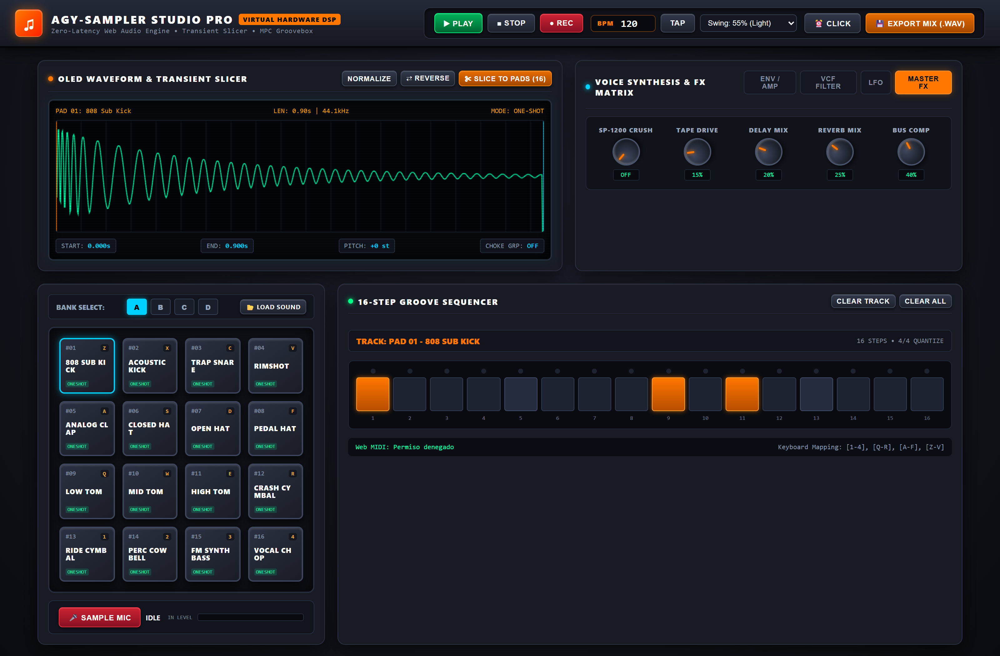
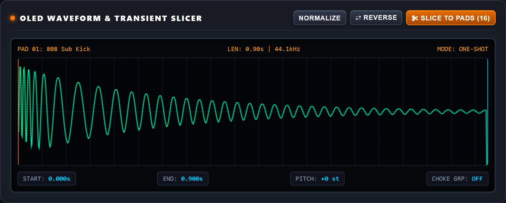
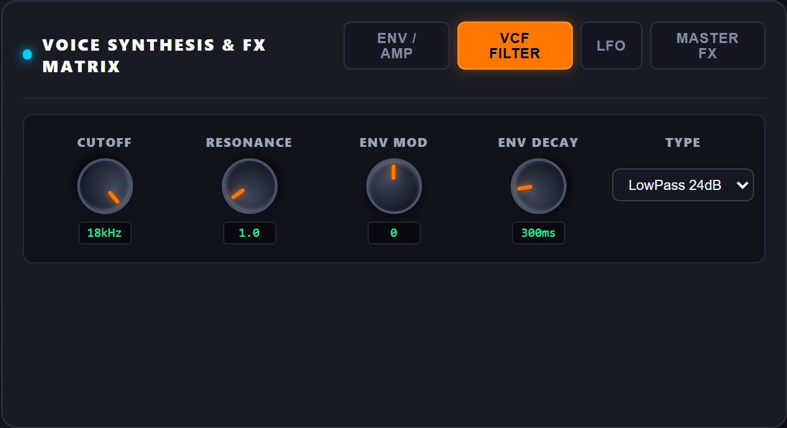
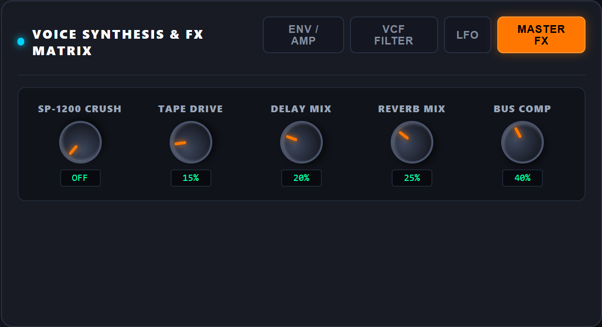
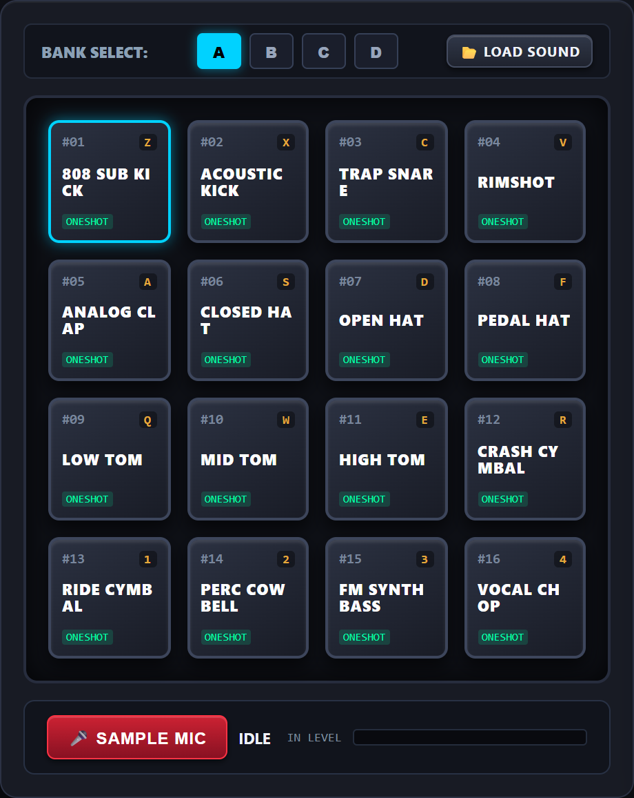
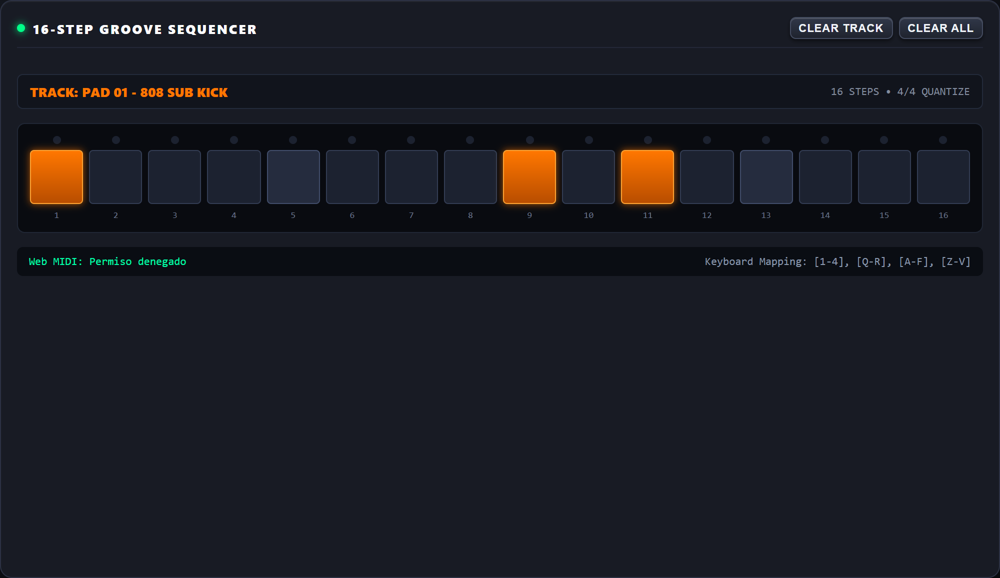

# 🥁 AGY-SAMPLER STUDIO PRO
### *Estación de Muestreo, Síntesis Analógica y Secuenciador Groovebox MPC en Web Audio DSP*

[](#)
[](#)
[](#)
[](#)
[](#)
[-purple.svg?style=for-the-badge)](#)
[](#)

---



---

## ⚡ Descripción General / Overview

**AGY-SAMPLER STUDIO PRO** es una estación de trabajo de producción musical (*Groovebox / MPC Workstation*) virtual de alta fidelidad, inspirada en las legendarias máquinas de muestreo hardware (Akai MPC, E-mu SP-1200, Roland TR-808/909). 

Construida con una arquitectura de ingeniería **100% autoportante (Single-File)** sin dependencias externas, compiladores ni dependencias de Node.js, ejecuta un motor de procesamiento de señal digital (**DSP**) de coma flotante de 64 bits directamente en el navegador mediante la **Web Audio API**.

Incluye:
- **Editor OLED de formas de onda** con corte de transitorios y autosegmentación (*Auto-Slicer* en 16 porciones).
- **Matriz de 16 Pads de Silicona** con iluminación RGB reactiva, soporte de 4 bancos (64 ranuras) y grupos de exclusión (*Choke Groups*).
- **Matriz de Síntesis por Voz**: Envolventes ADSR analógicas, filtro multimodo resonante VCF de 24 dB/oct, y modulación LFO asignable.
- **Rack de Efectos Master Vintage**: Emulador de SP-1200 Bitcrusher de 12 bits, Saturador de Cinta cálido, Tape Delay estéreo sincronizado al tempo, Reverb convolutiva y Compresor/Limitador de bus de salida.
- **Secuenciador de Pasos con Reloj Lookahead de Ultra Precisión**: 16 pasos por pista, swing analógico MPC (50% a 75%), metrónomo y grabación en vivo.
- **Muestreo en Vivo desde Micrófono/Línea** con medidor de nivel VU estéreo en tiempo real.
- **Control Físico**: Detección plug & play de controladores MIDI USB vía **Web MIDI API** y mapeo ergonómico para teclados de computadora.
- **Renderizado Offline a WAV**: Exportación en master estéreo PCM sin pérdida (44.1 kHz, 16 bits).

---

## 📸 Módulos de Hardware y Capturas de Interfaz

### 1. 🎛️ Pantalla OLED, Forma de Onda y Slicer de Transitorios
Visualización vectorial en tiempo real sobre pantalla OLED reflectiva. Permite arrastrar los marcadores de **Inicio (`START`)** y **Fin (`END`)**, aplicar **Normalización digital de pico**, **Inversión de muestra (`REVERSE`)** y disparar el algoritmo de corte automático **`SLICE TO PADS`** para trocear loops y baterías completas al instante.



### 2. 🎚️ Matriz de Síntesis por Voz & Filtros VCF Analógicos
Cada uno de los 16 pads cuenta con procesamiento de voz independiente:
- **Pestaña ENV / AMP**: Curva de volumen ADSR (Attack, Decay, Sustain, Release), afinación cromática (*Tuning* en semitonos) y panorama estéreo (*Pan*).
- **Pestaña VCF FILTER**: Filtro multimodo (LowPass 24dB, HighPass, BandPass, Notch), frecuencia de corte (*Cutoff*), resonancia (*Q*), profundidad de envolvente (*Env Mod*) y decaimiento (*Env Decay*).
- **Pestaña LFO**: Oscilador de baja frecuencia asignable a Tono, Corte o Panorama con formas de onda senoidal, triangular, cuadrada o sierra.

| Filtro VCF Resonante | Matriz de Efectos Master |
| :---: | :---: |
|  |  |

### 3. 📼 Rack de Efectos Vintage Master
Procesamiento analógico en el bus principal para otorgar pegada, calidez y textura clásica de vinilo y cinta:
- **SP-1200 Crush**: Reducción de tasa de muestreo y resolución a 12 bits para ese sonido icónico del hip-hop de los 90.
- **Tape Drive**: Saturación armónica de válvulas y cinta con limitación suave (*Soft Clipping*).
- **Delay Mix**: Eco estéreo con retardo sincronizado a subdivisiones de tempo BPM.
- **Reverb Mix**: Simulación de espacio acústico con amortiguación de altas frecuencias.
- **Bus Comp**: Compresión de bus estilo VCA con recuperación automática para compactar la mezcla final.

### 4. 🥁 Matriz de 16 Pads MPC y Grabador de Micrófono
Pads iluminados dinámicamente según la intensidad de disparo. Muestra el estado One-Shot/Loop, la tecla de acceso rápido asignada, y el grupo Choke para silenciar charles (*Hi-Hats*) abiertos al pulsar uno cerrado.



### 5. 🎼 Secuenciador de Pasos de Alta Precisión
Secuenciador por pasos con indicación visual por LED de la posición actual del cursor de reproducción, cuantización 4/4, swing analógico MPC seleccionable (desde 50% recto hasta 75% shuffle acentuado), y controles rápidos de borrado de pista o patrón completo.



---

## 📐 Especificaciones de Ingeniería y Arquitectura DSP

```mermaid
graph LR
    subgraph INGESTION ["Entrada de Audio"]
        A1["🎙️ Micrófono / Entrada de Línea"]
        A2["📁 Importador WAV / MP3 / FLAC"]
        A3["🔊 Sintetizadores Analógicos Offline"]
    end

    subgraph VOICE_DSP ["Procesamiento por Voz (x16 Pads)"]
        B1["Waveform Slicer / Trimmer"]
        B2["Pitch Shifter / Resampler"]
        B3["ADSR Amp Envelope"]
        B4["VCF Multimode Filter (24dB/oct)"]
        B5["LFO Modulation Engine"]
        B6["Choke Logic"]
    end

    subgraph MASTER_BUS ["Rack de Efectos Master"]
        C1["SP-1200 12-Bit Crusher"]
        C2["Tape Tube Saturation"]
        C3["Stereo BPM Delay"]
        C4["Algorithmic Reverb"]
        C5["VCA Master Bus Compressor"]
    end

    subgraph OUTPUT ["Salida"]
        D1["🔊 AudioContext Destination (Bocinas / Auriculares)"]
        D2["💾 OfflineAudioContext -> WAV Export (16-bit 44.1kHz)"]
    end

    INGESTION --> B1
    B1 --> B2 --> B3 --> B4 --> MASTER_BUS
    B5 -.->|Modula| B2
    B5 -.->|Modula| B4
    B6 -.->|Corta| B3
    MASTER_BUS --> C1 --> C2 --> C3 --> C4 --> C5
    C5 --> OUTPUT
```



| Especificación | Detalle Técnico |
| :--- | :--- |
| **Pipeline de Procesamiento** | 64-bit Floating-Point DSP Pipeline nativo de `AudioContext` |
| **Latencia de Audio** | `latencyHint: 'interactive'` (~2.8 ms a 5.5 ms con buffers hardware directos) |
| **Reloj de Secuenciación** | Algoritmo Web Audio Lookahead Timer (deriva temporal < 0.5 ms) |
| **Matriz de Pads** | 16 Pads virtuales x 4 bancos (`Bank A`, `Bank B`, `Bank C`, `Bank D`) = 64 sonidos |
| **Slicer Automático** | Detección matemática de transitorios y particionado simétrico 1/16 a pads |
| **Formatos Soportados** | WAV, MP3, AIFF, OGG, FLAC, AAC (decodificación directa vía Web Audio) |
| **Exportación** | Master mixdown estéreo PCM WAV (44.1 kHz, 16 bits) vía `OfflineAudioContext` |
| **Web MIDI** | Integración nativa sin drivers vía `navigator.requestMIDIAccess` |
| **Portabilidad** | 100% Single-File HTML / Vanilla JS / CSS3 (Sin node_modules, sin Webpack) |

---

## ⌨️ Mapeo de Teclado de Computadora

Puedes ejecutar ritmos directamente desde tu teclado como si fuera una MPC física:

```
┌──────────┬──────────┬──────────┬──────────┐
│  [ 1 ]   │  [ 2 ]   │  [ 3 ]   │  [ 4 ]   │
│ RIDE CYM │ COWBELL  │ FM BASS  │ VOCAL CH │  (Pads 13 - 16)
├──────────┼──────────┼──────────┼──────────┤
│  [ Q ]   │  [ W ]   │  [ E ]   │  [ R ]   │
│ LOW TOM  │ MID TOM  │ HIGH TOM │ CRASH CY │  (Pads 09 - 12)
├──────────┼──────────┼──────────┼──────────┤
│  [ A ]   │  [ S ]   │  [ D ]   │  [ F ]   │
│ CLAP     │ CH HAT   │ OPEN HAT │ PEDAL HT │  (Pads 05 - 08)
├──────────┼──────────┼──────────┼──────────┤
│  [ Z ]   │  [ X ]   │  [ C ]   │  [ V ]   │
│ 808 SUB  │ ACOUSTIC │ TRAP SNR │ RIMSHOT  │  (Pads 01 - 04)
└──────────┴──────────┴──────────┴──────────┘
```

### Controles de Transporte y Flujo de Trabajo
- **`Barra Espaciadora`**: Iniciar / Detener reproducción del secuenciador (`PLAY / STOP`).
- **`TAP`**: Ajuste intuitivo de tempo tocando al ritmo deseado con el ratón.
- **`CLICK`**: Conmutación de metrónomo audible para ensayar y grabar en tiempo real.
- **`REC`**: Activación de grabación en vivo sobre los pasos del secuenciador.

---

## 🔌 Embeber en Aplicaciones (.NET / Blazor / Electron / Web)

Al ser una solución de archivo único completamente autónoma y sin dependencias externas, puede integrarse de manera limpia y sin fricción en cualquier stack moderno:

### En Blazor / ASP.NET Core / HTML
```html
<iframe 
    src="index.html" 
    title="AGY Sampler Studio Pro"
    style="width: 100%; height: 95vh; border: none; border-radius: 12px; box-shadow: 0 10px 30px rgba(0,0,0,0.8);"
    allow="microphone; midi">
</iframe>
```

### En .NET MAUI / WPF / WinUI (WebView2)
```csharp
webView.Source = new Uri("file:///path/to/index.html");
```

---

## 🚀 Inicio Rápido / Quick Start

No requiere compilación ni instalación de paquetes (`npm install`).

1. **Clonar el repositorio:**
   ```bash
   git clone https://github.com/cdcespon/sampler.git
   cd sampler
   ```

2. **Ejecutar:**
   - **Opción A (Doble clic):** Abre directamente [`index.html`](./index.html) en Google Chrome, Microsoft Edge, Brave o Mozilla Firefox.
   - **Opción B (Servidor local ligero para habilitar micrófono y Web MIDI sin restricciones de protocolo `file://`):**
     ```bash
     # Con Python:
     python -m http.server 8080

     # O con Node:
     npx serve .
     ```
   - Abre tu navegador en `http://localhost:8080`.

---

## 🌐 Compatibilidad de Navegadores

| Navegador | Soporte Audio DSP | Web MIDI | Grabación Micrófono | Aceleración Canvas OLED |
| :--- | :---: | :---: | :---: | :---: |
| **Google Chrome** | ✅ 100% | ✅ Nativo | ✅ Si | ✅ 60 FPS |
| **Microsoft Edge** | ✅ 100% | ✅ Nativo | ✅ Si | ✅ 60 FPS |
| **Brave Browser** | ✅ 100% | ✅ Nativo | ✅ Si | ✅ 60 FPS |
| **Mozilla Firefox** | ✅ 100% | ⚠️ Requiere Add-on | ✅ Si | ✅ 60 FPS |
| **Apple Safari** | ✅ 100% | ⚠️ Parcial | ✅ Si | ✅ 60 FPS |

---

## 📄 Licencia

Este proyecto está bajo la Licencia **MIT**. Consulta el archivo de licencia para más detalles.

---

<div align="center">
  <sub>Desarrollado con pasión por el audio digital, los sintetizadores analógicos y la Web moderna. 🎛️⚡</sub>
</div>
